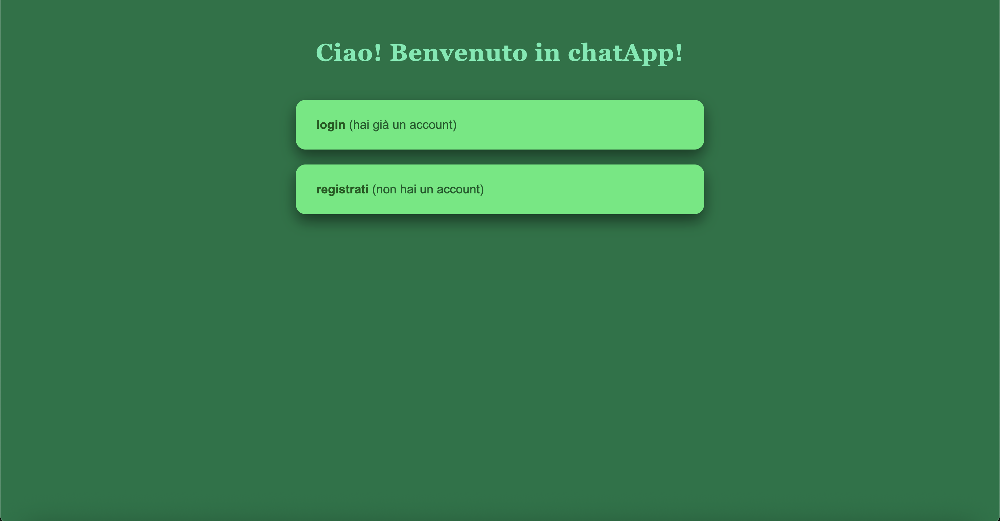
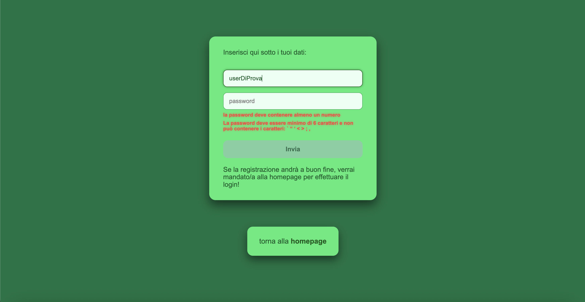
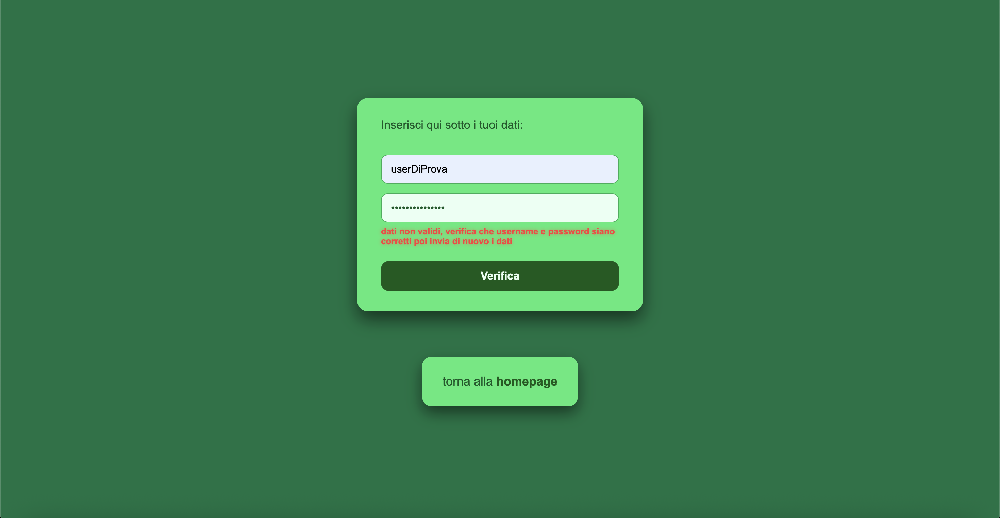
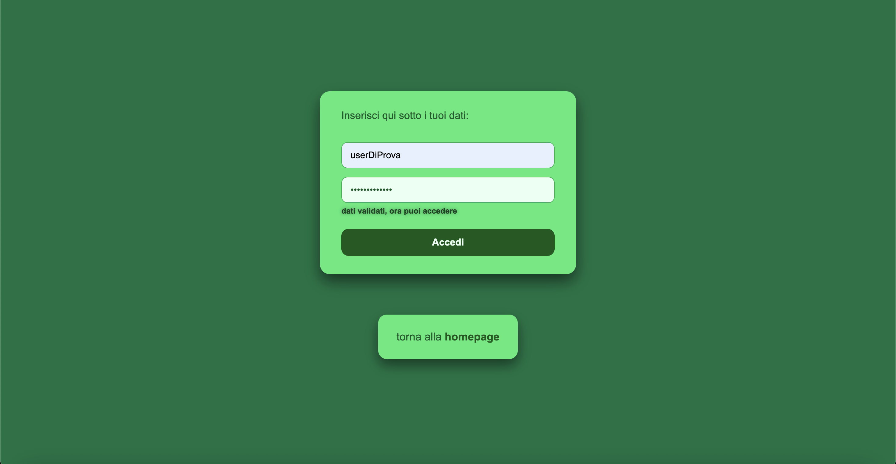
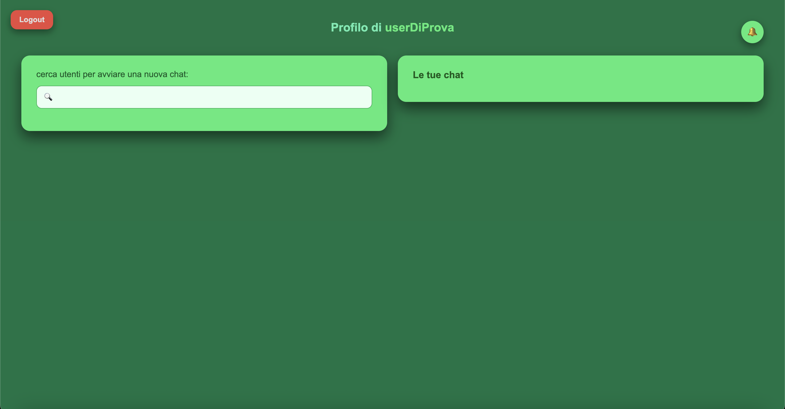
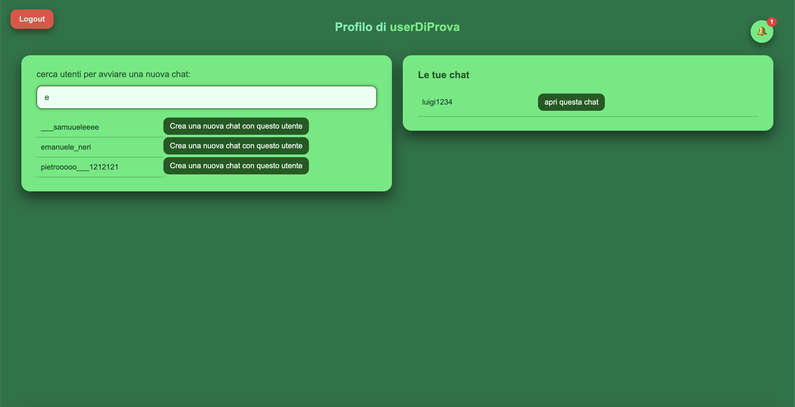
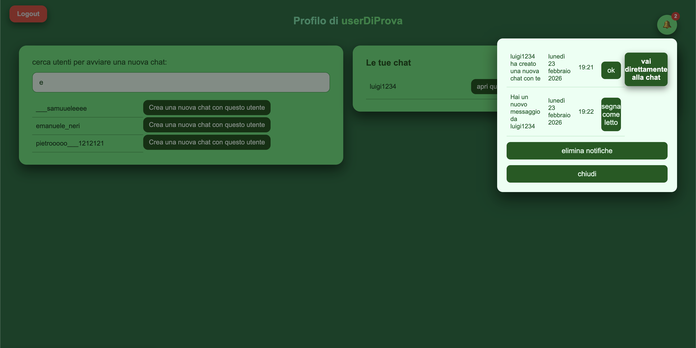
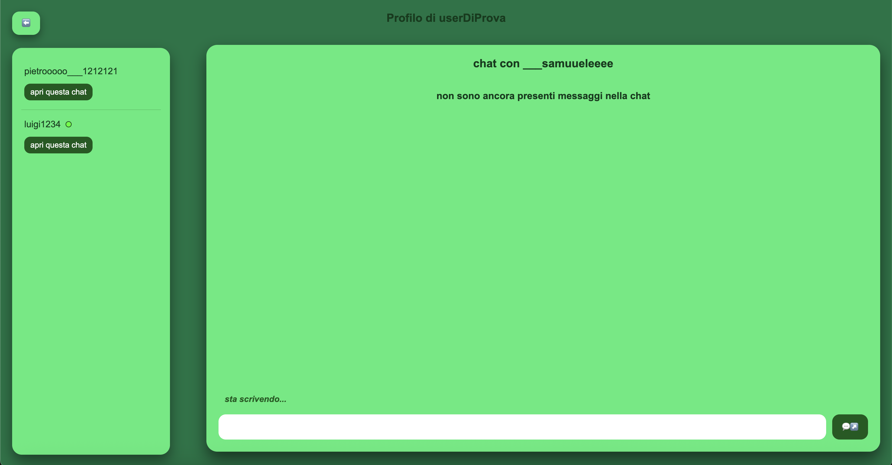
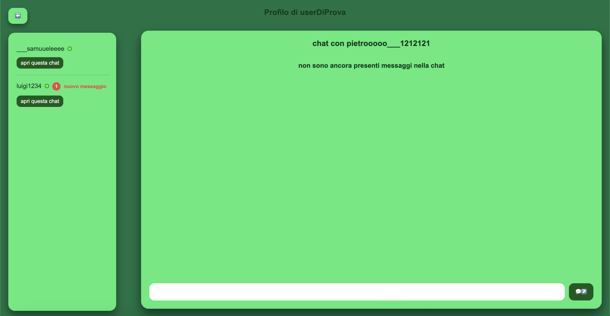
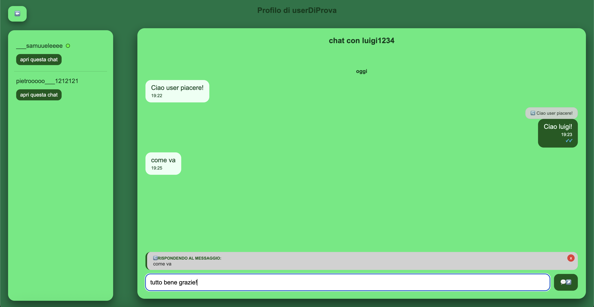

# 💬 ChatApp - Real-time Chat Application

Un'applicazione di messaggistica istantanea real-time costruita con Node.js, WebSocket e MySQL. Supporta chat 1-to-1, notifiche push, indicatori di lettura, e typing indicator.












## 📋 Indice
- [Caratteristiche](#-caratteristiche)
- [Tecnologie](#️-tecnologie)
- [Prerequisiti](#-prerequisiti)
- [Installazione](#-installazione)
- [Configurazione](#️-configurazione)
- [Utilizzo](#-utilizzo)
- [Struttura del progetto](#-struttura-del-progetto)
- [WebSocket Events](#-websocket-events)
- [Security Features](#️-security-features)
- [Rate Limiting](#-rate-limiting)
- [Deploy](#-deploy)
- [Roadmap](#-roadmap)
- [Autore](#-autore)
- [Licenza](#-licenza)

## ✨ Caratteristiche

### Core Features
- ✅ **Registrazione e Login** con autenticazione sicura (bcrypt)
- ✅ **Chat Real-time** via WebSocket
- ✅ **Notifiche Push** per nuovi messaggi e chat
- ✅ **Read Receipts** (doppia spunta stile WhatsApp)
- ✅ **Typing Indicator** ("sta scrivendo...")
- ✅ **Reply ai messaggi** (threading delle conversazioni)
- ✅ **Ricerca utenti** con debouncing
- ✅ **Indicatori presenza** (online/offline)
- ✅ **Sistema notifiche** con badge numero messaggi non letti

### Security & Performance
- 🔒 Password hashing con **bcrypt** (10 rounds)
- 🛡️ **Rate limiting** multi-livello (Redis + custom Map)
- ⚡ **WebSocket** per comunicazione real-time efficiente
- 🔐 **Session management** con express-session
- 🚫 **SQL injection protection** (prepared statements)
- ⏱️ **Timing attack prevention** su login

## 🛠️ Tecnologie

### Backend
- **Node.js** (v18+) - Runtime JavaScript
- **Express.js** (v5.2.1) - Web framework
- **MySQL2** (v3.16.0) - Database relazionale
- **WebSocket (ws)** (v8.18.3) - Comunicazione real-time
- **Redis** (v5.11.0) - Cache e rate limiting store
- **Bcrypt** (v6.0.0) - Password hashing
- **express-rate-limit** (v8.2.1) - Rate limiting middleware
- **express-session** (v1.19.0) - Session management
- **dotenv** (v17.2.3) - Environment variables

### Frontend
- **HTML5/CSS3** - Markup e styling
- **JavaScript Vanilla** - Logica client-side
- **WebSocket API** - Connessione real-time
- **CSS Animations** - Typing indicator animato

### Development
- **Nodemon** (v3.1.11) - Auto-restart su modifiche

## 📦 Prerequisiti

Prima di iniziare, assicurati di avere installato:

- [Node.js](https://nodejs.org/) v18 o superiore
- [MySQL](https://www.mysql.com/) v8 o superiore
- [Redis](https://redis.io/) v6 o superiore
- [Git](https://git-scm.com/) per clonare il repository

### Verifica installazioni
```bash
node --version  # v18.0.0+
npm --version   # v9.0.0+
mysql --version # v8.0.0+
redis-server --version # v6.0.0+
```

## 🚀 Installazione

### 1. Clona il repository
```bash
git clone https://github.com/tuousername/chatApp.git
cd chatApp
```

### 2. Installa le dipendenze
```bash
npm install
```

### 3. Configura il database MySQL

Crea il database e importa lo schema:
```bash
# Accedi a MySQL
mysql -u root -p

# Crea il database
CREATE DATABASE chat_app;
USE chat_app;

# Importa lo schema (vedi schema.sql)
source schema.sql;
```

### 4. Avvia Redis
```bash
# macOS (con Homebrew)
brew services start redis

# Linux
sudo systemctl start redis

# Windows (con installer)
redis-server

# Verifica che Redis sia attivo
redis-cli ping
# Risposta: PONG
```

## ⚙️ Configurazione

### Crea il file .env

Copia il file `.env.example` e rinominalo in `.env`:
```bash
cp .env.example .env
```

Modifica il file `.env` con le tue configurazioni:

```env
# ================================
# DATABASE CONFIGURATION
# ================================
DB_HOST=localhost
DB_USER=root
DB_PASSWORD=your_mysql_password
DB_DATABASE=chat_app
DB_PORT=3306
DB_WAITFORCONNECTIONS=true
DB_CONNECTION_LIMIT=10
DB_QUEUE_LIMIT=0

# ================================
# REDIS CONFIGURATION
# ================================
REDIS_HOST=localhost
REDIS_PORT=6379
REDIS_DB=0

# ================================
# SERVER CONFIGURATION
# ================================
PORT=3000

# ================================
# SESSION CONFIGURATION
# ================================
# IMPORTANTE: Cambia questo valore con una stringa random complessa
SECRET_SESSION=change_this_to_a_very_long_random_string_at_least_32_chars

# ================================
# BCRYPT CONFIGURATION
# ================================
SALT_ROUNDS=10

# ================================
# ENVIRONMENT
# ================================
NODE_ENV=development
```

### ⚠️ Note sulla sicurezza
- **NON** committare mai il file `.env` su Git
- Usa valori diversi per `SECRET_SESSION` in produzione
- Cambia le password di default del database

## 💻 Utilizzo

### Avvia l'applicazione

```bash
# Development (con auto-restart)
npm start

# Production
NODE_ENV=production node main.js
```

L'applicazione sarà disponibile su: **http://localhost:3000**

### Accedi all'applicazione

1. **Homepage:** `http://localhost:3000/chatApp/homepage`
2. **Registrazione nuovo utente:** Clicca su "registrazione"
3. **Accesso utente esistente:** Clicca su "login"
4. **Inizia a chattare!**

### Workflow tipico

1. **Registrazione** → Crea username e password
2. **Login** → Inserisci credenziali
3. **Homepage Utente** → Cerca utenti o apri chat esistenti
4. **Chat** → Invia messaggi, vedi "sta scrivendo...", ricevi notifiche, apri altre chat esistenti

## 📁 Struttura del progetto

```
chatApp/
│
├── controllers/              # Controller HTTP
│   └── controller.js        # Gestione richieste registrazione/login
│
├── db/                       # Database configuration
│   └── pool.js              # Connection pool MySQL
│
├── errors/                   # Error handling
│   └── httpError.js         # Custom HTTP error class
│
├── middlewares/              # Middleware Express e utility
│   ├── checkRegistration.middleware.js
│   ├── checkRegistrationDataChars.js
│   ├── error.middleware.js
│   ├── hashPassword.function.js      # Bcrypt utilities
│   ├── rateLimiter.function.js       # Rate limiters (Redis)
│   └── wsLoginLimiter.js             # Custom Map rate limiter
│
├── public/                   # File statici (client-side)
│   ├── css/                 # Stili CSS
│   │   ├── homepage.css
│   │   ├── homepageUtente.css
│   │   ├── login.css
│   │   ├── myChat.css
│   │   └── registrazione.css
│   │
│   ├── js/                  # JavaScript client-side
│   │   ├── config.js        # Configurazione URL dinamici
│   │   ├── homepageUtente.js
│   │   ├── login.js
│   │   ├── myChat.js
│   │   └── registrazione.js
│   │
│   ├── limiterResponse/     # Pagine HTML errore rate limit
│   │   ├── rispostaGlobalLimiter.html
│   │   └── rispostaRateLimitRegistrazione.html
│   │
│   ├── homepage.html        # Landing page
│   ├── homepageUtente.html  # Dashboard utente
│   ├── login.html           # Pagina registrazione
│   ├── registrazione.html   # Pagina accesso
│   ├── myChat.html          # Interfaccia chat
│   └── getAll.html          # 404 custom
│
├── routes/                   # Route Express
│   └── routes.js            # Definizione endpoint
│
├── services/                 # Business logic
│   └── service.js           # Servizi registrazione
│
├── ws/                       # WebSocket management
│   ├── socket.js            # WebSocket server setup
│   └── socket.functions.js  # Logica WebSocket (messaggi, notifiche, ecc.)
│
├── .env                      # Variabili d'ambiente (NON committare!)
├── .env.example             # Template variabili d'ambiente
├── .gitignore               # File da ignorare su Git
├── main.js                  # Entry point applicazione
├── package.json             # Dipendenze npm
├── package-lock.json        # Lock file dipendenze
├── README.md                # Questo file
└── schema.sql               # Schema database MySQL
```

## 🔌 WebSocket Events

### Client → Server

| Event | Descrizione | Payload |
|-------|-------------|---------|
| `INIT` | Inizializza connessione utente | `{username, from: "homepage"/"chat"}` |
| `CHECK_USERNAME` | Verifica disponibilità username | `{username}` |
| `VALIDATE_ACCESS` | Verifica credenziali login | `{username, psw}` |
| `NEW_MESSAGE` | Invia nuovo messaggio | `{message, sentFrom, sentTo, responseToMessageId?, responseToMessageContent?}` |
| `LOAD_MESSAGES` | Carica messaggi di una chat | `{myUsername, otherUsername}` |
| `GET_CHATS` | Carica lista chat utente | `{username, actualChat?}` |
| `ADD_NEW_CHAT` | Crea nuova chat con utente | `{username1, username2}` |
| `GET_UTENTI` | Ricerca utenti | `{search, username}` |
| `LOAD_NOTIFICATIONS` | Carica notifiche utente | `{username}` |
| `REMOVE_NOTIFICATIONS` | Segna notifiche come lette | `{username, id?}` |
| `MESSAGE_READ` | Segna messaggio come letto | `{id, otherUsername}` |
| `CHECK_USERS_STATUS` | Verifica stato online utenti | `{users: []}` |
| `GET_NOTIFICATIONS_CHAT` | Conta messaggi non letti per chat | `{users: [], myUsername}` |
| `IM_TYPING` | Notifica "sta scrivendo" | `{myUsername, otherUsername}` |
| `IM_NOT_TYPING` | Notifica "ha smesso di scrivere" | `{myUsername, otherUsername}` |

### Server → Client

| Event | Descrizione | Payload |
|-------|-------------|---------|
| `RESULT_VERIFY_ACCESS` | Risposta login | `{success: boolean, rateLimit?: {...}}` |
| `RETURN_CHECK_USERNAME` | Risposta verifica username | `{result: "username_ok"/"username_alredy_exist"}` |
| `LOAD_CHAT_AFTER_MESSAGE` | Aggiorna chat dopo invio messaggio | `{user1, user2}` |
| `GET_MESSAGES_RETURN` | Lista messaggi chat | `{success, result: [...]}` |
| `LOAD_CHATS_RESULT` | Lista chat utente | `{success, result1?, result2?}` |
| `RESULT_GET_UTENTI` | Risultati ricerca utenti | `{result: [...]}` |
| `LOAD_NOTIFICATIONS_RESULT` | Lista notifiche | `{success, result?: [...]}` |
| `LOAD_CHATS` | Trigger ricarica lista chat | `{}` |
| `LOAD_NOTIFICATIONS` | Trigger ricarica notifiche | `{}` |
| `CHECK_USERS_STATUS_RETURN` | Stati online/offline utenti | `{usersStatus: [...]}` |
| `GET_CHAT_NOTIFICATIONS_RESULT` | Numero messaggi non letti per chat | `{notificationsNumber: [...]}` |
| `IM_TYPING_RESPONSE` | Mostra "sta scrivendo" | `{otherUsername}` |
| `IM_NOT_TYPING_RESPONSE` | Nascondi "sta scrivendo" | `{otherUsername}` |
| `ADD_MESSAGE_RESPONSE` | Conferma invio messaggio | `{}` |
| `ADD_NEW_CHAT_RESPONSE` | Conferma creazione chat | `{msg?: "chat alredy exist"}` |

## 🛡️ Security Features

### Password Security
- ✅ **Bcrypt hashing** con 10 rounds (configurabile via .env)
- ✅ **Timing attack prevention**: fake hash comparison su username inesistente
- ✅ Validazione lunghezza password (6-64 caratteri)
- ✅ Validazione caratteri proibiti in password

### Rate Limiting

#### 1. Registration Limiter (Redis Store)
```javascript
Store: Redis
Window: 1 ora
Max: 15 tentativi per IP
Response: 429 + pagina HTML custom
```

#### 2. Login Limiter (Custom Map)
```javascript
Store: In-memory Map
Window: 15 minuti
Max: 5 tentativi per username
Auto-cleanup: Ogni 15 minuti
Reset: Dopo login successo
```

#### 3. Global Limiter
```javascript
Store: Memory
Window: 1 minuto
Max: 100 richieste per IP
```

### Session Security
- ✅ **express-session** con secret configurabile
- ✅ Session timeout: 24 ore
- ✅ Cookie httpOnly (default)

### Database Security
- ✅ **Prepared statements** (protezione SQL injection)
- ✅ **Connection pooling** per performance
- ✅ Credenziali da variabili d'ambiente

### WebSocket Security
- ✅ Validazione JSON.parse con try-catch
- ✅ Validazione tipo messaggi (`data.type` string check)
- ✅ Error handling su tutti i message handler

## 📊 Rate Limiting

### Comportamento Rate Limiters

#### Registrazione
- **15 tentativi/ora** per IP
- Dopo limite: blocco per 1 ora
- Store: **Redis** (persiste anche dopo restart server)
- Pagina errore: `rispostaRateLimitRegistrazione.html`

#### Login (WebSocket)
- **5 tentativi/15 minuti** per username
- Dopo limite: blocco per 15 minuti
- Store: **Map in-memory** (reset al restart server)
- Response: JSON con `minutiRimasti` e `resetAt`
- **Auto-reset** dopo login successo

#### Global
- **100 richieste/minuto** per IP
- Protegge da DDoS base
- Store: **Memory**

### Testare Rate Limiting

```bash
# Test registration rate limit
for i in {1..20}; do 
  curl -X POST http://localhost:3000/chatApp/checkRegistration \
    -d "username=test$i&psw=password123"; 
done

# Test global rate limit
for i in {1..150}; do 
  curl http://localhost:3000/chatApp/homepage; 
done
```

## 🌐 Deploy

### Opzione 1: Railway (Consigliato)

```bash
# Installa Railway CLI
npm i -g @railway/cli

# Login
railway login

# Inizializza progetto
railway init

# Aggiungi MySQL plugin
railway add mysql

# Aggiungi Redis plugin
railway add redis

# Deploy
railway up
```

**Configura variabili d'ambiente su Railway:**
1. Dashboard → Project → Variables
2. Aggiungi tutte le variabili da `.env`
3. Railway auto-configura `DATABASE_URL` e `REDIS_URL`

### Opzione 2: Render

1. Crea account su [Render](https://render.com)
2. New → Web Service
3. Connetti repository GitHub
4. Configura:
   - Build Command: `npm install`
   - Start Command: `node main.js`
5. Aggiungi PostgreSQL/Redis da Add-ons
6. Configura Environment Variables

### Opzione 3: VPS (DigitalOcean, Linode, AWS EC2)

```bash
# Sulla tua macchina
git push origin main

# Sul server
git clone https://github.com/tuousername/chatApp.git
cd chatApp
npm install --production

# Installa PM2 per process management
npm install -g pm2

# Avvia con PM2
pm2 start main.js --name chatApp
pm2 save
pm2 startup
```

### Post-Deploy Checklist
- ✅ Configura tutte le variabili d'ambiente
- ✅ Importa schema database
- ✅ Testa connessione Redis
- ✅ Configura HTTPS (Let's Encrypt)
- ✅ Abilita monitoring (PM2/Railway logs)
- ✅ Backup database periodici

## 🗺️ Roadmap

### Features in sviluppo
- [ ] Upload immagini/file in chat
- [ ] Gruppi chat (3+ persone)
- [ ] Emoji picker
- [ ] Voice messages
- [ ] Video call 1-to-1
- [ ] Dark mode

### Miglioramenti tecnici
- [ ] Pagination messaggi (LIMIT/OFFSET)
- [ ] Redis session store (scalabilità)
- [ ] Testing automatizzato (Jest + Supertest)
- [ ] Docker containerization
- [ ] CI/CD pipeline
- [ ] Prometheus metrics
- [ ] Database migrations con Knex.js

### Security enhancements
- [ ] 2FA (Two-Factor Authentication)
- [ ] End-to-end encryption
- [ ] CAPTCHA su registrazione
- [ ] Account verification via email

## 👨‍💻 Autore

**Samuele Mastrovincenzo**

<!-- - 🌐 Portfolio: [tuo-portfolio.com](https://tuo-portfolio.com)
- 💼 LinkedIn: [linkedin.com/in/tuo-profilo](https://linkedin.com/in/tuo-profilo) -->
- 🐙 GitHub: [@samueleee1016](https://github.com/samueleee1016)
- 📧 Email: samuele.mastrovincenzo@gmail.com

## 🤝 Contribuire

I contributi sono benvenuti! Per contribuire:

1. Fork il progetto
2. Crea un branch per la tua feature (`git checkout -b feature/AmazingFeature`)
3. Commit le modifiche (`git commit -m 'Add some AmazingFeature'`)
4. Push al branch (`git push origin feature/AmazingFeature`)
5. Apri una Pull Request

## 📄 Licenza

Questo progetto è rilasciato sotto licenza **MIT**. Vedi il file [LICENSE](LICENSE) per i dettagli.

---

## Ringraziamenti

- Express.js team per il framework
- Socket.io community per ispirazione WebSocket patterns
- Tutti i tester che hanno aiutato a migliorare l'app

---

<!-- <div align="center">

**⭐ Se questo progetto ti è stato utile, lascia una stella! ⭐**

Made with ❤️ and ☕ 

</div> -->